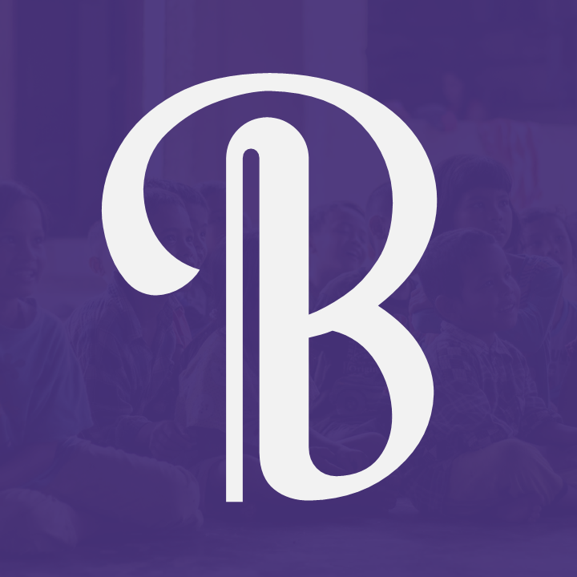
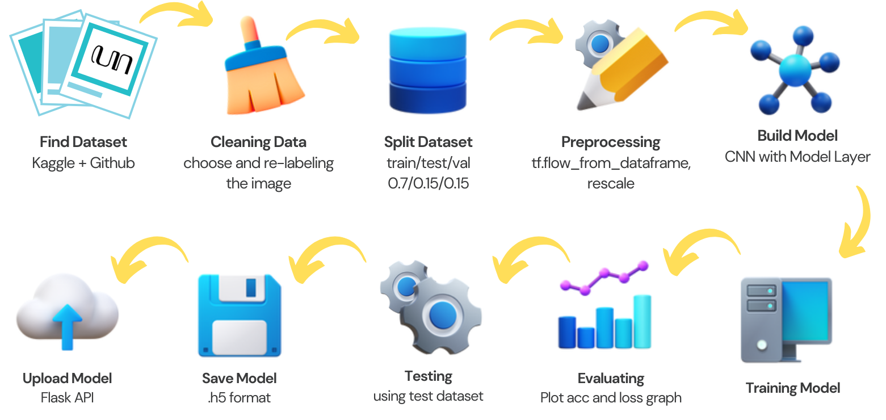

# Basuwara

Basuwara is an educational mobile application designed to promote the learning and preservation of traditional Indonesian scripts. This app then represents an opportunity to bridge the gap between the modern digital age and Indonesia's linguistic heritage, by providing an easy and exciting learning process.

This repository mainly stored the machine learning part to the project. The other components to the project can be found [here](https://github.com/vesouveeous/basuwara).

The machine learning workflow begins with collecting and combining the Sundanese, Javanese, and Balinese script dataset. Then, the data is split into training, validation, and testing sets. Afterwards, data augmentation is performed. The model itself is a Convolutional Neural Network (CNN) model, consisting of a few convolution layers, a flatten layer, and some dense layer in the end. The trained model is saved in a .h5 format, where Flask API is used to deploy it.

